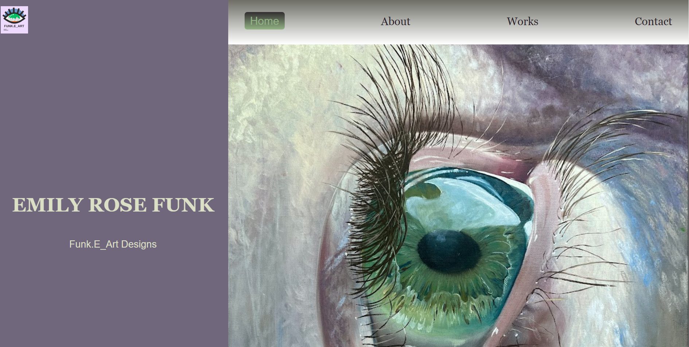

# Emily Rose Funk Portfolio

## Description

**Motivation**: I developed this portfolio with the aim of showcasing my skills and expertise as a full-stack developer, making it easier for potential employers to evaluate my capabilities.

**Purpose**: The primary goal of this project is to provide a comprehensive overview of my web development skills and past projects in one centralized location.

**Problem Solved**: By creating this portfolio, I have resolved the challenge of presenting my skills and qualifications effectively to prospective employers.

**Key Learnings**: During the development of this portfolio, I acquired valuable experience in building interactive web applications using React.

## Table of Contents

- [Installation](#installation)
- [Usage Instruction](#usage-instruction)
- [Deployed Application Link](#deployed-application-link)
- [GitHub Repository](#github-repository)
- [Screenshot](#screenshot)
- [Built With](#built-with)
- [Credits](#credits)
- [License](#license)
- [Badges](#badges)
- [Contribute](#how-to-contribute)
- [Tests](#tests)
- [Questions](#questions)

## Installation

Follow these steps to set up the development environment and run the project:

1. **Clone the Repository:** Start by cloning this repository to your local machine. You can do this using the following command:
```bash
git clone https://github.com/4funke/a-funke-portfolio.git
```
2. **Navigate to the Project Directory:**
Change your working directory to the cloned project folder:
```bash
cd a-funke-portfolio
```
3. **Install Dependencies:**
Install the necessary dependencies using your preferred package manager (e.g., npm or yarn). Run the following command:
```bash
npm install
```
4. **Start the Development Server:**
Once the dependencies are installed, start the development server to run the project locally:
```bash
npm start
```
5. **Access the Application:**
Open your web browser and visit http://localhost:3000 to access the running application.

That's it! You should now have the development environment set up, and the project should be running locally on your machine.

### Additional Resources
- [Deployed Application Link](#deployed-application-link) Check out our live application
- [GitHub Repository](#github-repository) For more details and to explore the code

## Usage Instruction: 
#### To effectively utilize our application, follow these step-by-step instructions:

### 1. Navigate the Homepage
- Visit the deployed application's homepage by entering the URL in your web browser.

### 2. Explore Sections
- Use the navigation bar at the top to explore different sections of the application:
  - Click on "About" to learn more about the developer.
  - Click on "Works" to view a portfolio of various web applications.
  - Click on "Contact" to get in touch with the developer.

### 3. About Section
- In the "About" section, you can:
  - Read a brief introduction about the developer.
  - Learn about their skills, experiences, and interests.

### 4. Works Section
- In the "Works" section, you can:
  - Browse through a collection of web applications.
  - Click on individual projects to view detailed information.
  - Explore project descriptions, images, and additional details.

### 5. Contact Section
- In the "Contact" section, you can:
  - Fill out the provided contact form to send a message to the developer.
  - Connect with the developer on social media platforms via the provided icons.

By following these detailed instructions, you'll be able to navigate and utilize the application's features seamlessly.

## Deployed Application Link:
[Deployed Application Link](https://4funke.github.io/a-funke-portfolio20/)

## GitHub Repository:
[GitHub Repository](https://github.com/4FunkE/a-funke-portfolio20)

## Screenshot


## Built With:

This project was developed using a variety of technologies and tools to ensure its functionality and interactivity. Here's an overview of the key technologies and tools used:

- **React**: A JavaScript library for building user interfaces. React was the core framework used to create the frontend of the application, allowing for the development of reusable UI components.

- **React Router**: A library for handling routing in a React application. It enabled the creation of different pages and navigation within the app.

- **React Icons**: A library that provides a collection of customizable icons. It was used to enhance the visual appeal of the user interface with various icons.

- **React Responsive Carousel**: A carousel component for React applications. It facilitated the implementation of an interactive project carousel in the "Works" section.

- **JSON**: A lightweight data interchange format. JSON was utilized for data storage and manipulation within the application.

- **gh-pages**: A tool for deploying a React app to GitHub Pages. It enabled the project to be easily hosted and accessible online.

- **Visual Studio Code**: An integrated development environment (IDE) for coding. Visual Studio Code served as the primary code editor for the project, providing a convenient environment for development.

These technologies and tools played a crucial role in creating a dynamic and engaging web application.

## Credits

Collaborators: 
- AskBCS Learning Assistants
- Andrew Bautista-Instructor
- Will-TA

## License

This application is covered under the MIT license. [](https://opensource.org/licenses/MIT)

## Badges


## Features

1. **Homepage:** The main landing page of your portfolio, providing an introduction and navigation to other sections.

2. **About Me:** A section where you provide information about yourself, your skills, background, and interests.

3. **Works/Projects:** A portfolio showcasing your previous works, projects, or applications. Each project may include:
   - Project name and description
   - Screenshots or images of the project
   - A link to the live project (if applicable)
   - Technologies used
   - Brief explanations of the project's purpose and your contributions

4. **Contact:** A section that allows visitors to get in touch with you. It may include a contact form with fields for name, email, and message, as well as links to your social media profiles and email address.

5. **Resume:** A downloadable PDF version of your resume, allowing visitors to access your full professional background.

6. **Navigation:** A navigation menu or bar that helps users move between different sections of your portfolio.

7. **Interactive Elements:** Features like hover effects, animations, or interactive components that enhance user experience and engagement.

8. **Responsive Design:** Ensuring that your portfolio is accessible and user-friendly on various devices, including desktops, tablets, and mobile phones.

9. **Styling and Theming:** Custom styling and theming to create a visually appealing and cohesive design.

10. **Deployment:** The ability to deploy your portfolio website to a hosting platform or server for public access.

11. **Accessibility:** Ensuring that your website is accessible to individuals with disabilities, adhering to web accessibility standards.

12. **SEO Optimization:** Implementing search engine optimization (SEO) techniques to improve your website's visibility on search engines like Google.

13. **Social Media Integration:** Links to your social media profiles, allowing visitors to connect with you on various platforms.

14. **Project Carousel:** An interactive carousel or slider displaying your projects for easy browsing.

## How to Contribute

If you created an application or package and would like other developers to contribute it, you can include guidelines for how to do so. The [Contributor Covenant](https://www.contributor-covenant.org/) is an industry standard, but you can always write your own if you'd prefer.

We welcome contributions to enhance and improve our project. Whether you're interested in fixing a bug, implementing new features, or enhancing documentation, your contributions are highly appreciated.

To contribute to our project, follow these steps:

1. Fork the Repository: Fork our repository to your own GitHub account by clicking the "Fork" button.
2. Clone the Repository: Clone the forked repository to your local machine using:
```bash
git clone https://github.com/4funke/a-funke-portfolio.git 
```
3. Create a New Branch: Create a new branch to work on your contribution using:
```bash
git checkout -b your-feature-branch 
```
4. Make Changes: Make your desired changes or additions to the codebase.
5. Test Your Changes: Test your changes thoroughly to ensure they work as expected.
6. Commit Your Changes: Commit your changes with clear and concise commit messages that describe the purpose of your changes. For example:
```bash
git commit -m "Add: Brief description of your changes"  
```
7. Push to Your Fork: Push your changes to your forked repository:
```bash
git push origin your-feature-branch 
```
8. Open a Pull Request: Open a pull request from your feature branch to our main repository. Provide a clear title and description for your pull request, outlining the changes you've made.
9. Review and Feedback: Participate in the discussion, address any feedback, and iterate on your changes as needed.

By following these steps, you contribute to the growth and enhancement of our project. We value your time and effort, and your contributions will make a positive impact.

If you're unsure about where to start or need assistance at any point, feel free to reach out. Together, we can make our project even better!

## Tests

n/a

## Questions
If you have any questions or need further assistance, feel free to reach out. You can contact me through my [GitHub profile](https://github.com/4FunkE) or via email at 4funkecodes@gmail.com. I'm here to help and support you in any way I can. Have a funke day!